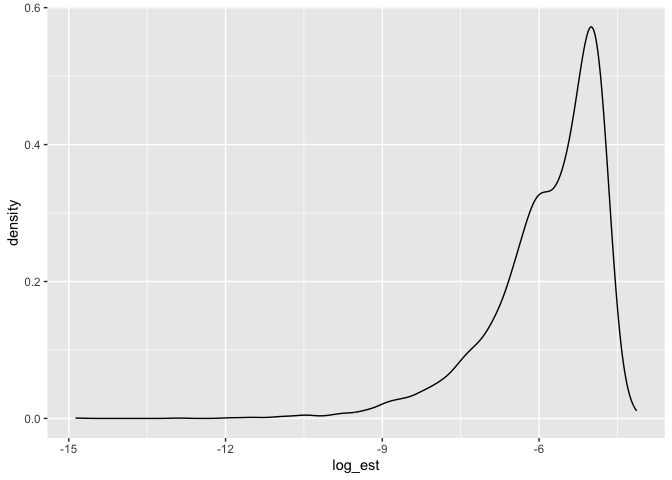
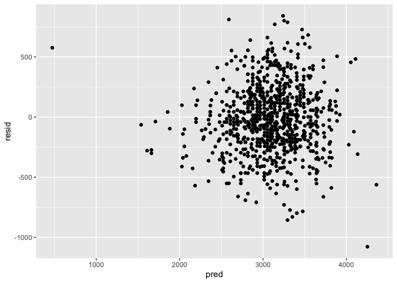

HW6: Markdown file
================
Kevin Liu
2023-12-02

# Problem 1

The Washington Post has gathered data on homicides in 50 large U.S.
cities and made the data available through a GitHub repository here. You
can read their accompanying article here.

``` r
raw_homicide_data =
  read_csv("./data/homicide-data.csv") |> 
  janitor::clean_names()
```

    ## Rows: 52179 Columns: 12
    ## ── Column specification ────────────────────────────────────────────────────────
    ## Delimiter: ","
    ## chr (9): uid, victim_last, victim_first, victim_race, victim_age, victim_sex...
    ## dbl (3): reported_date, lat, lon
    ## 
    ## ℹ Use `spec()` to retrieve the full column specification for this data.
    ## ℹ Specify the column types or set `show_col_types = FALSE` to quiet this message.

**Data Process**

Create a city_state variable (e.g. “Baltimore, MD”), and a binary
variable indicating whether the homicide is solved.

Omit cities Dallas, TX; Phoenix, AZ; and Kansas City, MO – these don’t
report victim race. Also omit Tulsa, AL – this is a data entry mistake.
For this problem, limit your analysis those for whom victim_race is
white or black. Be sure that victim_age is numeric.

- Omit: Dallas, TX, Phoeniz, AZ, Kansas City, MO, and Tulsa Al
- Include only when victim_race == “white” or “black”
- victim_age has to be numeric

``` r
processs_homicide_data = 
  raw_homicide_data |> 
  
  #Create variable "city_state" which is a concatenation of city + state separated by , .
  mutate(city_state = paste(city, state, sep = ", ")) |> 
  
  #Omit Dallas, Phoenix, Kansas Ciry, and Tulsa
  filter(!grepl("Dallas, TX|Phoenix, AZ|Kansas City, MO|Tulsa, AL", city_state)) |> 
  
  #Include victim_race == "white" or "black"
  filter(grepl("White|Black", victim_race)) |> 
  
  #victim_age is numeric
  mutate(victim_age = as.numeric(victim_age))
```

    ## Warning: There was 1 warning in `mutate()`.
    ## ℹ In argument: `victim_age = as.numeric(victim_age)`.
    ## Caused by warning:
    ## ! NAs introduced by coercion

## For the city of Baltimore, MD, use the glm function…

to fit a *logistic regression* with resolved vs unresolved as the
outcome and victim age, sex and race as predictors.

- Outcome: Resolved vs. Unresolved (1 or 0 Binary)
- PRedictors
  - Age: Continuous
  - Sex: Binary
  - Race: Binary

**Resolved vs. Unresolved (Binary Var)**

``` r
#Process Data
resolved_data =
  processs_homicide_data |> 
  
  #create binary variable that is 1 or 0 dpeending on if resolved or not
  mutate(resolve = ifelse(disposition %in% c("Closed without arrest", "Open/No arrest"), 0, 1)) 
  
  #NOTE: glm is able to automatically define binary despite the variables being defined as strings. Race + Sex left alone
```

**Logistic Regression**

``` r
homicide_logistic =
  resolved_data |> 
  glm(resolve ~ victim_age + victim_race + victim_sex, data = _, family = binomial()) 
```

**Tidy**

Save the output of glm as an R object; apply the broom::tidy to this
object;

``` r
#Extract all parameter estimates from logistic regression
homicide_param_est = 
  homicide_logistic |> 
  broom::tidy() |> 
  mutate(OR = exp(estimate), OR_CI = exp(confint(homicide_logistic))) |>
  select(term, log_OR = estimate, OR, OR_CI, p.value)
```

    ## Waiting for profiling to be done...

**OR of Male vs. Female**

Obtain the estimate and confidence interval of the adjusted odds ratio
for solving homicides comparing male victims to female victims keeping
all other variables fixed.

``` r
homicide_param_est_male_female = 
  homicide_param_est |> 
  filter(grepl("victim_sexMale", term))
```

- OR Estimate = 0.6028675
  - 95% CI: (0.568848, 0.6388225)

## Now run glm for each of the cities in your dataset,

and extract the adjusted odds ratio (and CI) for solving homicides
comparing male victims to female victims. Do this within a “tidy”
pipeline, making use of purrr::map, list columns, and unnest as
necessary to create a dataframe with estimated ORs and CIs for each
city.

**Broom function**

``` r
broom_conf = function(df) {
  broom::tidy(df, conf.int = TRUE)
}
```

``` r
citystate_OR_CI_hom = 
  resolved_data |> 
  nest(data = -city_state) |> 
  mutate(
    models = map(data, \(df) glm(resolve ~ victim_age + victim_race + victim_sex, data = df, family = binomial())),
    results = map(models, broom_conf)) |> 
  select(-data, -models) |> 
  unnest(results) |> 
  mutate(OR = exp(estimate), lowCI = exp(conf.low), uppCI = exp(conf.high)) |>
  filter(grepl("victim_sexMale", term)) |> 
  select(city_state, OR, lowCI, uppCI)
```

    ## Warning: There were 44 warnings in `mutate()`.
    ## The first warning was:
    ## ℹ In argument: `results = map(models, broom_conf)`.
    ## Caused by warning:
    ## ! glm.fit: fitted probabilities numerically 0 or 1 occurred
    ## ℹ Run `dplyr::last_dplyr_warnings()` to see the 43 remaining warnings.

Create a plot that shows the estimated ORs and CIs for each city.
Organize cities according to estimated OR, and comment on the plot.

``` r
citystate_OR_CI_hom[order(citystate_OR_CI_hom$OR),] |>  
  mutate(city_state = factor(city_state, levels = city_state)) |> 
  ggplot(aes(x = city_state, y = OR)) +
  geom_errorbar(aes(ymin = lowCI, ymax = uppCI))+
  coord_flip()
```

<!-- -->

# Problem 2

``` r
# Central Park Weather Data
weather_df = 
  rnoaa::meteo_pull_monitors(
    c("USW00094728"),
    var = c("PRCP", "TMIN", "TMAX"), 
    date_min = "2022-01-01",
    date_max = "2022-12-31") |>
  mutate(
    name = recode(id, USW00094728 = "CentralPark_NY"),
    tmin = tmin / 10,
    tmax = tmax / 10) |>
  select(name, id, everything())
```

    ## Registered S3 method overwritten by 'hoardr':
    ##   method           from
    ##   print.cache_info httr

    ## using cached file: /Users/kl/Library/Caches/org.R-project.R/R/rnoaa/noaa_ghcnd/USW00094728.dly

    ## date created (size, mb): 2023-09-28 13:49:36.87383 (8.524)

    ## file min/max dates: 1869-01-01 / 2023-09-30

The boostrap is helpful when you’d like to perform inference for a
parameter / value / summary that doesn’t have an easy-to-write-down
distribution in the usual repeated sampling framework.

We’ll focus on a simple linear regression with *tmax* as the response
with *tmin* and *prcp* as the predictors, and are interested in the
distribution of two quantities estimated from these data: r^2 + log(b1
\* b2)

## Bootstrap

Use 5000 bootstrap samples and, for each bootstrap sample, produce
estimates of these two quantities. Plot the distribution of your
estimates, and describe these in words. Using the 5000 bootstrap
estimates, identify the 2.5% and 97.5% quantiles to provide a 95%
confidence interval for r̂ 2 and log(β̂ 0∗β̂ 1).

``` r
weather_boostrap = 
  weather_df |> 
  select(-name, -id) |> 
  modelr::bootstrap(n = 5000) |> 
  mutate(
    models = map(strap, \(df) lm(tmax ~ tmin + prcp, data = df) ),
    results_tidy = map(models, broom::tidy),
    results_glance = map(models, broom::glance)) |> 
  select(-models) |> 
  unnest(results_tidy)
```

**r^2 Estimate + Conf. Interval**

``` r
#r^2 estimate plot + CI
r_squared =
  weather_boostrap |> 
  select(.id, term, results_glance) |> 
  unnest(results_glance) |> 
  group_by(.id) |>
  select(r.squared) |> 
  distinct()
```

    ## Adding missing grouping variables: `.id`

``` r
zval = qnorm(.975)
r_mean = mean(r_squared$r.squared)
r_sd = sd(r_squared$r.squared)
count = nrow(r_squared)
me = zval * (r_sd/sqrt(count))
```

- r^2 Mean: 0.9169099
- r^2 95% CI: (0.9165334, 0.9172864)

**r^2 plot**

``` r
r_squared |> 
  ggplot(aes(x = r.squared)) +
  geom_density()
```

<!-- -->

**log(beta1 \* beta2)**

``` r
log_b1_b2_df = 
  weather_boostrap |> 
  select(.id, term, estimate) |> 
  pivot_wider(
    names_from = term,
    values_from = estimate
  ) |> 
  mutate(log_est = log(abs(tmin * prcp)))
```

**Plot log(b1 \* b2)**

``` r
log_b1_b2_df |> 
  ggplot(aes(x = log_est)) +
  geom_density()
```

<!-- -->

# Problem 3

In this problem, you will analyze data gathered to understand the
effects of several variables on a child’s birthweight. This dataset,
available here, consists of roughly 4000 children and includes the
following variables:

Load and clean the data for regression analysis (i.e. convert numeric to
factor where appropriate, check for missing data, etc.).

**Load**

``` r
raw_birthweight_data =
  read_csv("./data/birthweight.csv") |> 
  janitor::clean_names()
```

    ## Rows: 4342 Columns: 20
    ## ── Column specification ────────────────────────────────────────────────────────
    ## Delimiter: ","
    ## dbl (20): babysex, bhead, blength, bwt, delwt, fincome, frace, gaweeks, malf...
    ## 
    ## ℹ Use `spec()` to retrieve the full column specification for this data.
    ## ℹ Specify the column types or set `show_col_types = FALSE` to quiet this message.

**Clean**

``` r
birthweight_df = 
  raw_birthweight_data |> 
  
  #convert frace to categorical var, convert to factor
  mutate(frace = factor(frace)) |> 
  
  #convert mrace to categorical var, convert to factor
  mutate(mrace = factor(mrace))
```

## Propose + Compare your Models

**Proposed Model**

The proposed model will be a linear regression as the outcome is a
continuous variable. - BirthWeight = length, gestational age, sex,
mrace, frace - Hypothesis: race of mother/father may act as social
factors that may significantly affect birthweight.

``` r
proposed_model = lm(bwt ~ blength + gaweeks + babysex + mrace + frace, data = birthweight_df)
```

**Main Effect Model**

- BirthWeight = Length at Birth + Gestational Age

``` r
main_model = lm(bwt ~ blength + gaweeks, data = birthweight_df) 
```

**Three Way Model**

- BirthWeight = Head Circumference, Length, Baby Sex, and All
  Interactions

``` r
interaction_model = lm(bwt ~ blength + bhead + babysex + blength:bhead + blength:babysex + bhead:babysex + bhead:blength:babysex, data = birthweight_df)
```

### Comparing Models: Residuals vs. Predicted

**Create Test/Training Data**

``` r
cv_bwt_df = 
  crossv_mc(birthweight_df, 100) |> 
  mutate(
    train = map(train, as_tibble),
    test = map(test, as_tibble)) |> 
  mutate(
      prop_mod = map(train, \(df) lm(bwt ~ blength + gaweeks + babysex + mrace + frace, data = df)),
      main_mod = map(train, \(df) lm(bwt ~ blength + gaweeks, data = df)),
      inter_mod = map(train, \(df) lm(bwt ~ blength + bhead + babysex + blength:bhead + blength:babysex + bhead:babysex + bhead:blength:babysex, data = df))
      ) |> 
  mutate(
    rmse_prop = map2_dbl(prop_mod, test, \(mod, df) rmse(model = mod, data = df)),
    rmse_main    = map2_dbl(main_mod, test, \(mod, df) rmse(model = mod, data = df)),
    rmse_inter = map2_dbl(inter_mod, test, \(mod, df) rmse(model = mod, data = df)))
```

**Proposed Model: Residuals vs. Predictors**

``` r
#Take one test sample + plot the predictoed vs. residuals for each sample.
cv_bwt_df |> 
  pull(test) |> 
  nth(1) |> 
  as_tibble() |> 
  add_predictions(proposed_model) |> 
  add_residuals(proposed_model) |> 
  ggplot(aes(x = pred, y = resid)) + 
  geom_point() 
```

<!-- -->

**Main Model: Residuals vs. Predictors**

``` r
cv_bwt_df |> 
  pull(test) |> 
  nth(1) |> 
  as_tibble() |> 
  add_predictions(main_model) |> 
  add_residuals(main_model) |> 
  ggplot(aes(x = pred, y = resid)) + 
  geom_point() 
```

<!-- -->

**3 Way Model: Residuals vs. Predictors**

``` r
cv_bwt_df |> 
  pull(test) |> 
  nth(1) |> 
  as_tibble() |> 
  add_predictions(interaction_model) |> 
  add_residuals(interaction_model) |> 
  ggplot(aes(x = pred, y = resid)) + 
  geom_point() 
```

<!-- -->

By comparing the models based on residuals and predictors, it seems they
all fit quite similarly.

- In more detail, it seems that the 3 way model fits this particular
  test sample a bit better as the scatterplot is more tightly comppacted
  around the resid = 0 line.

### Comparing Models: MSE

``` r
cv_bwt_df |> 
  select(starts_with("rmse")) |> 
  pivot_longer(
    everything(),
    names_to = "model", 
    values_to = "rmse",
    names_prefix = "rmse_") |> 
  mutate(model = fct_inorder(model)) |> 
  ggplot(aes(x = model, y = rmse)) + geom_violin()
```

<!-- -->
